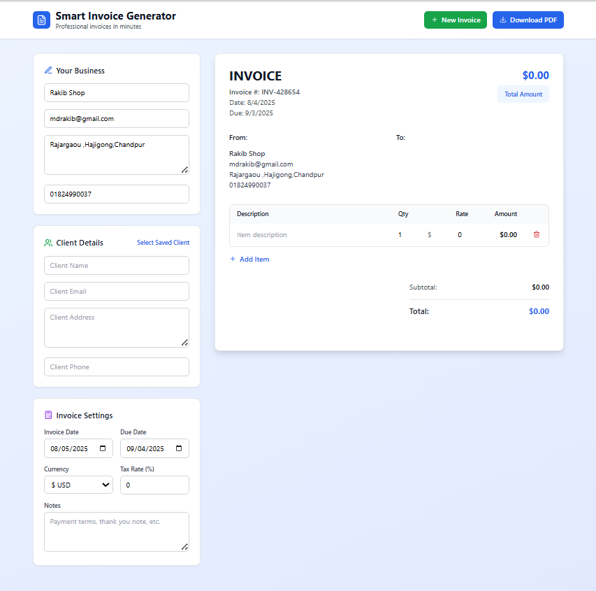

# 🧾 Smart Invoice Generator

**Smart Invoice Generator** is a user-friendly, professional invoicing tool that helps you create and download beautiful, well-structured invoices in just a few clicks. Designed with simplicity and clarity in mind, this tool is perfect for freelancers, small businesses, and entrepreneurs who need to generate invoices quickly and efficiently.



## 🚀 Features

- ✅ Create professional invoices in minutes
- 📝 Add business and client details
- ➕ Add multiple line items with quantity, rate, and automatic total calculation
- 📅 Set invoice and due dates
- 💰 Customize currency and tax rate
- 📄 Add notes (e.g., payment terms, thank you messages)
- 💾 Save and reuse client data
- 📤 Export and download invoice as a PDF
- 🎨 Clean, responsive, and easy-to-use UI

## 🛠️ Technologies Used

- **Frontend:** HTML, Tailwind , React
- **Date Picker:** Custom or third-party date picker libraries

## 📦 Getting Started

To run the project locally:

1. Clone the repository:

   ```bash
   git clone https://github.com/MdAthikhasan/smart-invoice-generator.git
   ```

2. Navigate to the project folder:

   ```bash
   cd smart-invoice-generator
   ```

3. install npm:

   ```bash
   npm install
   ```

4. run development server:

   ```bash
   npm run dev
   ```

> No backend or database setup is required. Everything runs on the client side.

## 📷 Screenshot


## 🧠 How It Works

- Fill in **Your Business** and **Client Details**.
- Add item(s) with quantity and rate to calculate totals.
- Select currency and tax rate if needed.
- Customize dates and notes.
- Click **Download PDF** to export your invoice.

## 📌 Future Improvements

- Save invoices to local storage or cloud
- Email invoices directly to clients
- Authentication and invoice history
- Support for multi-language and multi-currency

```

```
